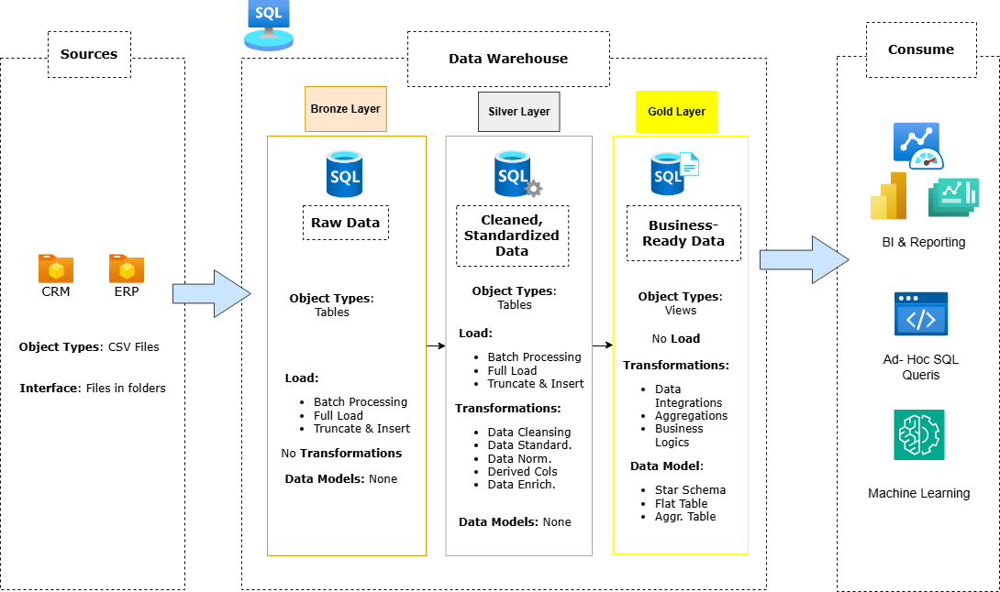
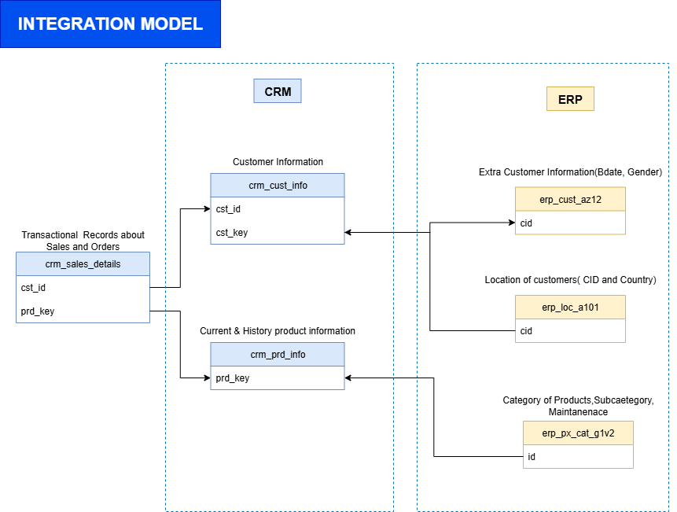

# Data Warehouse and Analytics Project

Welcome to the **Data Warehouse and Analytics Project** repository! 🚀  
This project demonstrates a comprehensive data warehousing and analytics solution, from building a data warehouse to generating actionable insights. Designed as a portfolio project, it highlights industry best practices in data engineering and analytics.

---
## 📖 Project Overview

This project involves:

1. **Data Architecture**: Designing a Modern Data Warehouse Using Medallion Architecture **Bronze**, **Silver**, and **Gold** layers.
2. **ETL Pipelines**: Extracting, transforming, and loading data from source systems into the warehouse.
3. **Data Modeling**: Developing fact and dimension tables optimized for analytical queries.
4. **Analytics & Reporting**: Creating SQL-based reports and dashboards for actionable insights.

🎯 This repository is an excellent resource for professionals and students looking to showcase expertise in:
- SQL Development
- Data Architect
- Data Engineering  
- ETL Pipeline Developer  
- Data Modeling  
- Data Analytics  

---

## 🛠️ Important Links & Tools:

Everything is for Free!
- **[Datasets](datasets/):** Access to the project dataset (csv files).
- **[SQL Server Express](https://www.microsoft.com/en-us/sql-server/sql-server-downloads):** Lightweight server for hosting your SQL database.
- **[SQL Server Management Studio (SSMS)](https://learn.microsoft.com/en-us/sql/ssms/download-sql-server-management-studio-ssms?view=sql-server-ver16):** GUI for managing and interacting with databases.
- **[Git Repository](https://github.com/):** Set up a GitHub account and repository to manage, version, and collaborate on your code efficiently.
- **[DrawIO](https://www.drawio.com/):** Design data architecture, models, flows, and diagrams.
- **[Notion Project Steps](https://www.notion.so/Data-Warehouse-Project-1ab63cda6e0980dc9296e86aea894070):** Access to All Project Phases and Tasks.

---

## 🚀 Project Requirements

### Building the Data Warehouse (Data Engineering)

#### Objective
Develop a modern data warehouse using SQL Server to consolidate sales data, enabling analytical reporting and informed decision-making.

#### Specifications
- **Data Sources**: Import data from two source systems (ERP and CRM) provided as CSV files.
- **Data Quality**: Cleanse and resolve data quality issues prior to analysis.
- **Integration**: Combine both sources into a single, user-friendly data model designed for analytical queries.
- **Scope**: Focus on the latest dataset only; historization of data is not required.
- **Documentation**: Provide clear documentation of the data model to support both business stakeholders and analytics teams.

---

### BI: Analytics & Reporting (Data Analysis)

#### Objective
Develop SQL-based analytics to deliver detailed insights into:
- **Customer Behavior**
- **Product Performance**
- **Sales Trends**

These insights empower stakeholders with key business metrics, enabling strategic decision-making.  

For more details, refer to [docs/requirements.md](docs/requirements.md).

---
## 🏗️ Data Architecture

The data architecture for this project follows Medallion Architecture **Bronze**, **Silver**, and **Gold** layers:


1. **Bronze Layer**: Stores raw data as-is from the source systems. Data is ingested from CSV Files into SQL Server Database.
2. **Silver Layer**: This layer includes data cleansing, standardization, and normalization processes to prepare data for analysis.
3. **Gold Layer**: Houses business-ready data modeled into a star schema required for reporting and analytics.

---
## 🧩 Integration Model

The following diagram illustrates the **Integration Model** of the Data Warehouse, showing the flow of data across the Bronze, Silver, and Gold layers, including relationships between source systems, transformation logic, and final analytical outputs.




## 📂 Repository Structure
```
data-warehouse-project/
│
├── datasets/                           # Raw datasets used for the project (ERP and CRM data)
│
├── docs/                               # Project documentation and architecture details
│   ├── etl.drawio                      # Draw.io file shows all different techniquies and methods of ETL
│   ├── data_architecture.drawio        # Draw.io file shows the project's architecture
│   ├── data_catalog.md                 # Catalog of datasets, including field descriptions and metadata
│   ├── data_flow.drawio                # Draw.io file for the data flow diagram
│   ├── data_models.drawio              # Draw.io file for data models (star schema)
│   ├── naming-conventions.md           # Consistent naming guidelines for tables, columns, and files
│
├── scripts/                            # SQL scripts for ETL and transformations
│   ├── bronze/                         # Scripts for extracting and loading raw data
│   ├── silver/                         # Scripts for cleaning and transforming data
│   ├── gold/                           # Scripts for creating analytical models
│
├── tests/                              # Test scripts and quality files
│
├── README.md                           # Project overview and instructions
├── LICENSE                             # License information for the repository
├── .gitignore                          # Files and directories to be ignored by Git
└── requirements.txt                    # Dependencies and requirements for the project
```
## 🗂️ Data Catalog (Gold Layer)

This section documents the **business-ready (Gold)** layer of the data warehouse.  
The Gold layer follows a **Star Schema** design optimized for analytics and reporting, with **fact** and **dimension** views built on top of the curated Silver layer.

---

### 🧍‍♂️ Dimension: `gold.dim_customers`

| **Column Name**   | **Description**                                                                 | **Data Type**   | **Notes** |
|-------------------|---------------------------------------------------------------------------------|-----------------|------------|
| `customer_key`    | Surrogate key generated with `ROW_NUMBER()` for dimensional modeling.           | INT             | Primary key in the dimension table. |
| `customer_id`     | Natural customer ID from source CRM system.                                    | VARCHAR / INT   | Used to join with fact table. |
| `customer_number` | Customer business identifier from ERP system.                                  | VARCHAR         | Alternative business key. |
| `first_name`      | Customer’s first name.                                                         | VARCHAR         |  |
| `last_name`       | Customer’s last name.                                                          | VARCHAR         |  |
| `country`         | Country of the customer, sourced from ERP location data.                       | VARCHAR         | Derived from `silver.erp_loc_a101`. |
| `marital_status`  | Customer’s marital status.                                                     | VARCHAR         |  |
| `gender`          | Gender information (from CRM or ERP if missing).                               | VARCHAR         | Logic handles missing or “n/a” values. |
| `birthdate`       | Customer date of birth.                                                        | DATE            | From `silver.erp_cust_az12`. |
| `create_date`     | Date the customer was created in the CRM system.                               | DATETIME        | Useful for cohort or retention analysis. |

**Grain:** One record per unique customer.  
**Sources:**  
- `silver.crm_cust_info`  
- `silver.erp_cust_az12`  
- `silver.erp_loc_a101`

---

### 📦 Dimension: `gold.dim_products`

| **Column Name**   | **Description**                                                                 | **Data Type**   | **Notes** |
|-------------------|---------------------------------------------------------------------------------|-----------------|------------|
| `product_key`     | Surrogate key generated with `ROW_NUMBER()` for dimensional modeling.           | INT             | Primary key in the dimension table. |
| `product_id`      | Natural product ID from CRM.                                                   | VARCHAR / INT   | Used to link to facts. |
| `product_number`  | Product business identifier from ERP system.                                   | VARCHAR         |  |
| `product_name`    | Product name.                                                                  | VARCHAR         |  |
| `category_id`     | Category identifier linked to category table.                                  | VARCHAR / INT   |  |
| `category`        | Product category name.                                                         | VARCHAR         | From `silver.erp_px_cat_g1v2`. |
| `sub_category`    | Product subcategory.                                                           | VARCHAR         |  |
| `maintenance`     | Maintenance category/flag.                                                     | VARCHAR         |  |
| `cost`            | Product cost.                                                                  | DECIMAL         |  |
| `product_line`    | Product line or group name.                                                    | VARCHAR         |  |
| `start_date`      | Product start/active date.                                                     | DATE            | Historical (ended) products are filtered out. |

**Grain:** One record per active product.  
**Sources:**  
- `silver.crm_prd_info`  
- `silver.erp_px_cat_g1v2`

---

### 💰 Fact: `gold.fact_sales`

| **Column Name**   | **Description**                                                                 | **Data Type**   | **Notes** |
|-------------------|---------------------------------------------------------------------------------|-----------------|------------|
| `order_number`    | Unique sales order identifier.                                                 | VARCHAR / INT   | Natural key for fact table. |
| `product_key`     | Foreign key referencing `dim_products.product_key`.                            | INT             |  |
| `customer_key`    | Foreign key referencing `dim_customers.customer_key`.                          | INT             |  |
| `order_date`      | Date the order was placed.                                                     | DATE            |  |
| `shipping_date`   | Date the order was shipped.                                                    | DATE            |  |
| `due_date`        | Date the order is due for delivery/payment.                                    | DATE            |  |
| `sales_amount`    | Total sales amount for the order line.                                         | DECIMAL         |  |
| `quantity`        | Quantity sold.                                                                 | INT             |  |
| `price`           | Unit price of the product at sale time.                                        | DECIMAL         |  |

**Grain:** One record per sales order line item.  
**Sources:**  
- `silver.crm_sales_details`  
- Joined with `gold.dim_products` and `gold.dim_customers` for dimension enrichment.

---

### 🧩 Relationships

| **Fact Table** | **Dimension**   | **Join Key**                                            | **Relationship Type** |
|----------------|-----------------|---------------------------------------------------------|-----------------------|
| `fact_sales`   | `dim_customers` | `fact_sales.customer_key = dim_customers.customer_key` | Many-to-one |
| `fact_sales`   | `dim_products`  | `fact_sales.product_key = dim_products.product_key`    | Many-to-one |

---

### 🌟 Summary

- **Data Model Type:** Star Schema  
- **Purpose:** To enable efficient analytical queries on sales performance by customer and product.  
- **Medallion Layer:** Gold (Business-level layer for reporting and BI tools)  
- **Storage:** SQL Server Views built on curated Silver tables

---
## 🌟 About Me

Hi there! I'm **Sefa Bockun**. I’m an IT professional and passionate Data Scientist.

Let's stay in touch! Feel free to connect with me on the following platforms:

[](https://www.linkedin.com/in/sefabckn/)
[](https://sefabckn.github.io/SefaTheAnalyst.github.io/index.html)
